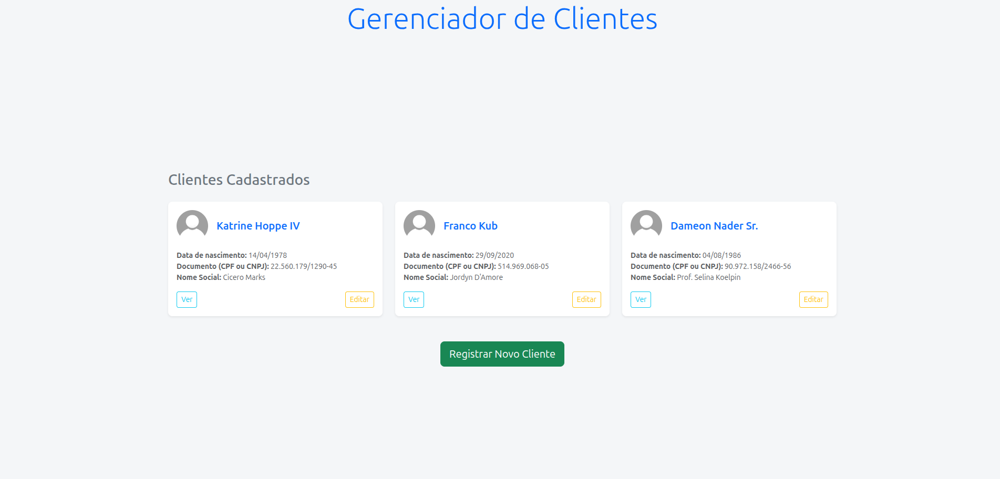

# Gerenciador de Clientes - PBSoft Challenge



> Este projeto é uma solução para o desafio técnico proposto pela PBSoft, desenvolvido utilizando o framework Laravel.

### Tecnologias utilizadas

- [Laravel](https://laravel.com/) – Framework PHP para desenvolvimento web
- [PHP](https://www.php.net/) – Linguagem de programação
- [Bootstrap](https://getbootstrap.com/) – Framework CSS para design responsivo
- [Composer](https://getcomposer.org/) – Gerenciador de dependências PHP
- [MySQL](https://www.mysql.com/) – Sistema de gerenciamento de banco de dados
- [Node.js](https://nodejs.org/) – Ambiente de execução JavaScript
- [npm](https://www.npmjs.com/) – Gerenciador de pacotes JavaScript

## Funcionalidades

- [x] Criação de cliente
- [x] Edição de cliente
- [x] Deletar cliente
- [x] Visualizar cliente individualmente
- [x] Listagem de clientes
- [x] Validação descritiva dos erros
- [x] Validação de formulário através do request no back-end
- [X]  Regra customizada para validação de CPF/CNPJ
- [x] Tratamento de imagens

## Pré-requisitos

- PHP >= 8.0
- Composer
- Node.js e NPM
- MySQL (ou outro banco de dados de sua preferência)

## Instalando pbsoft-challenge

Para instalar o pbsoft-challenge, siga estas etapas:

Siga os passos abaixo para rodar o projeto localmente:

```bash
# Clone o repositório
git clone https://github.com/Murillou/pbsoft-challenge.git

# Acesse a pasta do projeto
cd pbsoft-challenge

# Instale as dependências PHP
composer install

# Copie o arquivo de variáveis de ambiente e configure com suas credenciais
cp .env.example .env

# Configurar .env para carregar seu banco de dados
Abra o arquivo `.env` e configure os dados do seu banco de dados:
    
DB_CONNECTION=mysql
DB_HOST=127.0.0.1
DB_PORT=3306
DB_DATABASE=seu_banco_de_dados
DB_USERNAME=seu_usuario
DB_PASSWORD=sua_senha
    
# Gere a chave da aplicação
php artisan key:generate

# Execute as migrações
php artisan migrate

# Crie o link simbólico para as imagens
php artisan storage:link

# Instale as dependências frontend
npm install

# Compile os arquivos com Vite e inicie o servidor
composer run dev
```

### Desenvolvido com 💙 por Murillo Vinícius

